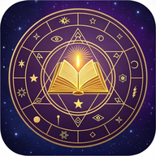

# 🔮 Weltenbibliothek - Chroniken der verborgenen Pfade

<p align="center">
  
</p>

<p align="center">
  <strong>Progressive Flutter App für alternative Geschichte, verborgenes Wissen und paranormale Phänomene</strong>
</p>

<p align="center">
  
  
  
  
  
</p>

---

## 🚀 **Build 90 - Neue Features!**

### ✨ **Alle 4 Features vollständig implementiert:**

#### 📎 **File-Upload System**
- FilePicker Integration (jpg, jpeg, png, pdf, mp4, mp3, doc, docx)
- 10MB Größenlimit mit Echtzeit-Validierung
- Base64-Encoding für Firebase Storage
- Media-Type Detection & Upload-Progress Dialog
- Nur im Chat-Kanal verfügbar

#### 👤 **User Authentication**
- **Anonymous Auto-Login** beim App-Start (Gast-Modus)
- **Email/Password Registrierung** & Login
- **User Profile Management** in Firestore
- **Dynamische User IDs** in Telegram-Chats
- Profile-Streaming mit Real-time Updates

#### 🔔 **Push Notifications**
- **Firebase Cloud Messaging (FCM)** vollständig aktiv
- Foreground & Background Message Handling
- **Local Notifications** mit Tap-Navigation
- **Topic Subscriptions** für Telegram-Channels
- Automatische Permission-Requests (iOS & Android)

#### 📥 **Offline-Mode**
- **Hive NoSQL Database** Integration
- Automatisches Message-Caching im Hintergrund
- **Favorites & Read Receipts** lokal gespeichert
- Firestore Offline Persistence (unbegrenzte Cache-Größe)
- Funktioniert ohne Internetverbindung

---

## 🔧 **Kritische Fixes (Build 90)**

- ✅ **Media Library**: Lädt aus existierenden Collections (`audiobooks`, `pdf_documents`, `images`, `videos`)
- ✅ **Chat**: Memory-Sorting statt Firestore `orderBy()` (vermeidet Composite Index-Probleme)
- ✅ **Feldnamen-Kompatibilität** für verschiedene Collection-Strukturen
- ✅ **Type-Detection** für Media-Dateien basierend auf Extensions

---

## 📱 Über die App

**Weltenbibliothek** ist eine einzigartige App, die wissenschaftliche Echtzeitdaten mit alternativen Perspektiven der Geschichte vereint. Entdecke verborgenes Wissen, verfolge paranormale Phänomene und erkunde die Chroniken der verborgenen Pfade.

### ✨ Highlights

- 🌍 **Live-Daten Dashboard**: Schumann-Resonanz, Erdbeben, ISS-Position, Sonnenaktivität
- ⏱️ **Historische Timeline**: 10 Event-Kategorien mit Multi-Perspektiven-System
- 📚 **Umfangreiche Bibliothek**: Organisierte Sammlung historischer Mysterien
- 🎨 **Mystisches Dark Theme**: Violett-Gold Design für optimale Atmosphäre
- 🔄 **Auto-Refresh**: Echtzeit-Updates von wissenschaftlichen Quellen
- 📡 **Keine API-Keys**: Nutzt öffentliche APIs ohne Registrierung

---

## 🎯 Features

### 🏠 Home-Dashboard
- **Kosmisches Status-Dashboard** mit Live-Indikatoren
- **Schumann-Resonanz Monitoring** (Tomsk Observatory)
- **Erdbeben-Tracking** (USGS 24h-Daten)
- **ISS Live-Position** (Open-Notify API)
- **Sonnenaktivität** (K-Index, Sonnenstürme)
- Schnellzugriff zu allen App-Bereichen

### ⏱️ Historische Timeline
- **10 Event-Kategorien**:
  - 🏛️ Verlorene Zivilisationen
  - 👽 Außerirdische Kontakte
  - 🔺 Geheimgesellschaften
  - 📡 Technologie-Mysterien
  - 🌀 Dimensionale Anomalien
  - 🔮 Okkulte Ereignisse
  - 📜 Verbotenes Wissen
  - 🛸 UFO-Flotten
  - ⚡ Energiephänomene
  - 🌍 Globale Verschwörungen

- **Multi-Perspektiven-System**:
  - 🏛️ Mainstream
  - 🔍 Alternativ
  - 🕵️ Verschwörung
  - 🧘 Spirituell
  - 🔬 Wissenschaftlich

- **Trust-Level-System** (1-5 Sterne)
- **Quellenangaben** mit Verifikation
- **Geografische Verortung** mit Koordinaten

### 📚 Bibliothek
- Grid-Layout mit Kategorie-Karten
- Volltext-Suchfunktion
- Event-Zähler pro Kategorie
- Favoriten-System
- Filter & Sortierung

### ⚙️ Mehr-Bereich
- Push-Benachrichtigungen (für wichtige Ereignisse)
- Daten Export/Import (PDF, JSON, CSV)
- App teilen
- Einstellungen
- Über & Datenschutz

---

## 🎨 Design-System

### Farbpalette
```
Primary Purple:    #6B46C1  // Mystisches Violett - Weisheit & Spiritualität
Secondary Gold:    #D4AF37  // Edles Gold - Altes Wissen & Erleuchtung
Background Dark:   #1a1a2e  // Kosmisches Dunkelblau-Schwarz
Surface Dark:      #16213e  // Strukturierendes Dunkelblau
Error Red:         #FF6B6B  // Klares Warnsignal-Rot
Text White:        #FFFFFF  // Maximale Lesbarkeit
```

### Typografie
- **Überschriften**: Google Fonts "Cinzel" (antike Ausstrahlung)
- **Fließtext**: Google Fonts "Lato" (moderne Lesbarkeit)

---

## 🚀 Installation

### Voraussetzungen
- Flutter SDK 3.35.4
- Android Studio oder VS Code
- Android SDK (API Level 21+)

### Schnellstart
```bash
# Repository klonen
git clone <REPOSITORY_URL>
cd flutter_app

# Dependencies installieren
flutter pub get

# App im Debug-Modus starten
flutter run

# Release APK bauen
flutter build apk --release
```

Für detaillierte Setup-Anleitung siehe [SETUP.md](SETUP.md).

### 📥 **Direkte APK-Downloads (Build 90)**

**🌐 Web-App (Live Preview)**:  
🔗 [Weltenbibliothek Web-App öffnen](https://5060-i0sts42562ps3y0etjezb-cc2fbc16.sandbox.novita.ai)

**📱 Android APKs**:
- ✅ **ARM64** (37.7 MB) - Empfohlen für moderne Geräte  
  📥 [Download ARM64-APK](https://www.genspark.ai/api/code_sandbox/download_file_stream?project_id=781a9c41-1ab2-4aab-b51f-4751d39f7875&file_path=%2Fhome%2Fuser%2Fflutter_app%2Fbuild%2Fapp%2Foutputs%2Fflutter-apk%2Fapp-arm64-v8a-release.apk&file_name=Weltenbibliothek-v3.1.0-arm64.apk)

- **ARMv7** (34.4 MB) - Für ältere Geräte  
  📥 [Download ARMv7-APK](https://www.genspark.ai/api/code_sandbox/download_file_stream?project_id=781a9c41-1ab2-4aab-b51f-4751d39f7875&file_path=%2Fhome%2Fuser%2Fflutter_app%2Fbuild%2Fapp%2Foutputs%2Fflutter-apk%2Fapp-armeabi-v7a-release.apk&file_name=Weltenbibliothek-v3.1.0-armv7.apk)

- **x86_64** (39.3 MB) - Für Emulatoren  
  📥 [Download x86_64-APK](https://www.genspark.ai/api/code_sandbox/download_file_stream?project_id=781a9c41-1ab2-4aab-b51f-4751d39f7875&file_path=%2Fhome%2Fuser%2Fflutter_app%2Fbuild%2Fapp%2Foutputs%2Fflutter-apk%2Fapp-x86_64-release.apk&file_name=Weltenbibliothek-v3.1.0-x86_64.apk)

**Mindestanforderungen**: Android 7.0 (API 24+), 50 MB Speicherplatz

---

## 🔧 Technologie

### Flutter & Dart
- **Flutter**: 3.35.4 (stable)
- **Dart**: 3.9.2

### Firebase (Optional)
- Authentication
- Firestore Database
- Cloud Storage
- Cloud Messaging
- Analytics
- Remote Config

### Kern-Dependencies
- **UI**: google_fonts, flutter_svg, flutter_animate
- **State**: provider
- **Network**: http, dio
- **Storage**: hive, shared_preferences
- **Location**: geolocator, flutter_map
- **Charts**: fl_chart

---

## 📡 APIs & Datenquellen

Die App nutzt ausschließlich öffentliche APIs ohne API-Keys:

1. **USGS Earthquake API**
   - Echtzeit Erdbeben-Daten (24h)
   - Refresh: 5 Minuten

2. **Open-Notify ISS API**
   - Live ISS-Position
   - Refresh: 10 Sekunden

3. **Tomsk Space Observatory**
   - Schumann-Resonanz Spektrogramme
   - Refresh: 60 Sekunden

---

## 📦 Downloads

### Release APK
- **Version**: 1.0.0
- **Größe**: ~51 MB
- **Min. Android**: 5.0 (API 21)
- **Target Android**: 15 (API 35)

Siehe `build/app/outputs/flutter-apk/app-release.apk`

---

## 🌐 Web-Demo

Die App ist auch als Progressive Web App verfügbar:

```bash
flutter build web --release
python3 -m http.server 8000 --directory build/web
```

---

## 📸 Screenshots

_Coming soon..._

---

## 🗺️ Roadmap

### Version 1.0 ✅
- [x] Home-Dashboard mit Live-Daten
- [x] Historische Timeline
- [x] Bibliothek mit Suche
- [x] Einstellungen & Export
- [x] Dark Theme
- [x] Release APK

### Version 1.1 (Geplant)
- [ ] Interaktive 3D-Weltkarte
- [ ] Ley-Linien Visualisierung
- [ ] Heilige Stätten Marker
- [ ] Erweiterte Filter

### Version 2.0 (Geplant)
- [ ] Gemini 2.0 Flash AI-Chat
- [ ] KI-Analysefunktionen
- [ ] Mustererkennung
- [ ] Predictive Analytics

### Version 2.1 (Geplant)
- [ ] Community Crowd-Sourcing
- [ ] Sichtungs-Meldungen
- [ ] Verifikationssystem
- [ ] Community-Karte

### Version 3.0 (Geplant)
- [ ] Binaurale Beats Player
- [ ] Meditations-Programme
- [ ] Bewusstseins-Frequenzen
- [ ] Timer & Playlists

### Version 3.1 (Geplant)
- [ ] Analytics Dashboard
- [ ] Trend-Analysen
- [ ] Korrelations-Charts
- [ ] Prognose-Modelle

---

## 🤝 Beitragen

Contributions sind willkommen! So kannst du helfen:

1. **Fork** das Repository
2. **Create** einen Feature Branch (`git checkout -b feature/AmazingFeature`)
3. **Commit** deine Änderungen (`git commit -m 'Add AmazingFeature'`)
4. **Push** zum Branch (`git push origin feature/AmazingFeature`)
5. **Open** einen Pull Request

---

## 📄 Lizenz

Dieses Projekt ist unter der MIT-Lizenz lizenziert. Siehe [LICENSE](LICENSE) für Details.

---

## 🙏 Danksagungen

- **Flutter Team** für das großartige Framework
- **Firebase** für Backend-Services
- **USGS** für Erdbeben-Daten
- **Open-Notify** für ISS-Tracking
- **Tomsk Space Observatory** für Schumann-Resonanz-Daten
- **Google Fonts** für Cinzel & Lato Schriftarten

---

## 📞 Kontakt & Support

- **Issues**: [GitHub Issues](https://github.com/username/weltenbibliothek/issues)
- **Email**: support@weltenbibliothek.app
- **Website**: https://weltenbibliothek.app

---

## ⚠️ Disclaimer

Diese App dient zu Informations- und Unterhaltungszwecken. Die präsentierten alternativen Perspektiven und Theorien sollten kritisch betrachtet werden. Wir ermutigen zu eigener Recherche und wissenschaftlichem Denken.

---

<p align="center">
  Entwickelt mit 🔮 von der Weltenbibliothek Community<br>
  <strong>© 2025 Weltenbibliothek. Alle Rechte vorbehalten.</strong>
</p>

---

**Entdecke die verborgenen Pfade. Erweitere dein Bewusstsein. Erkenne die Wahrheit.** ✨
